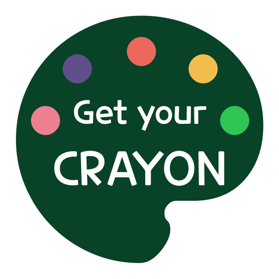
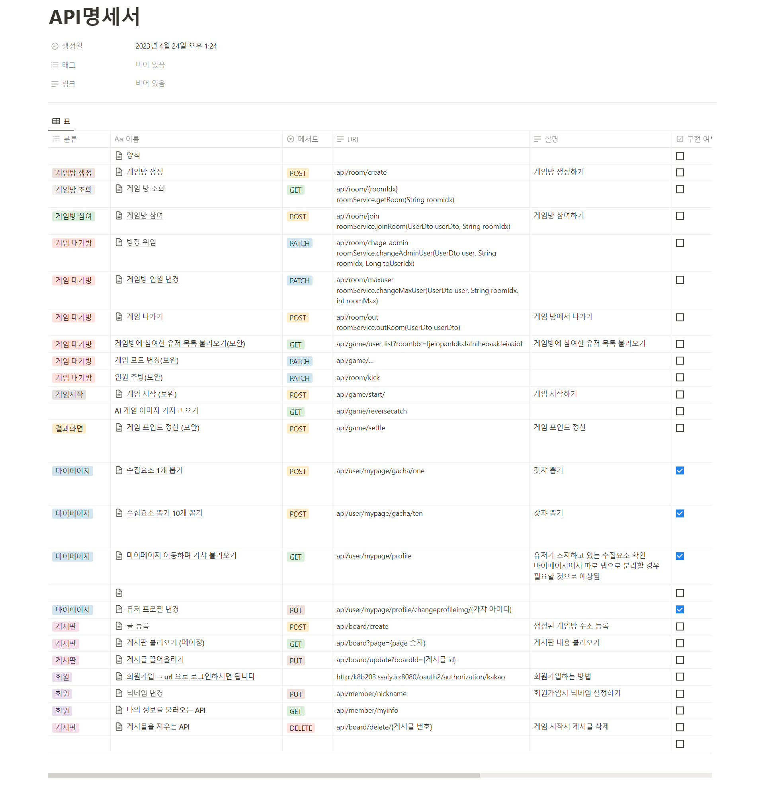
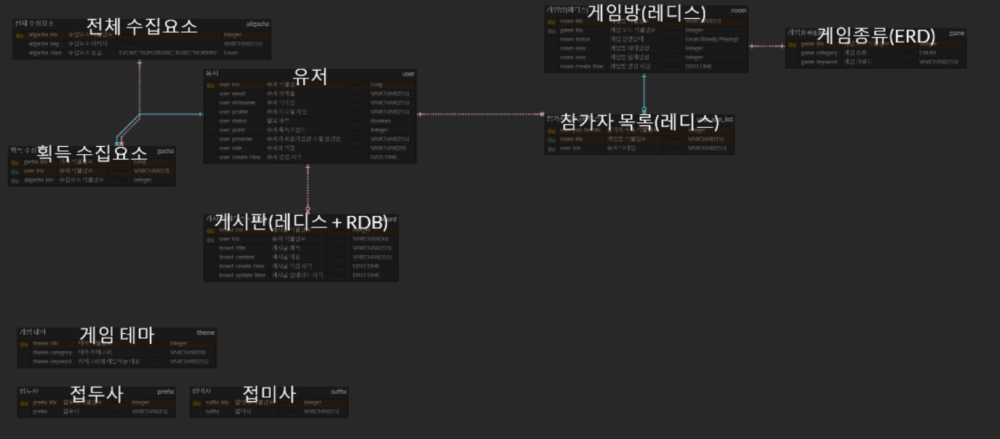
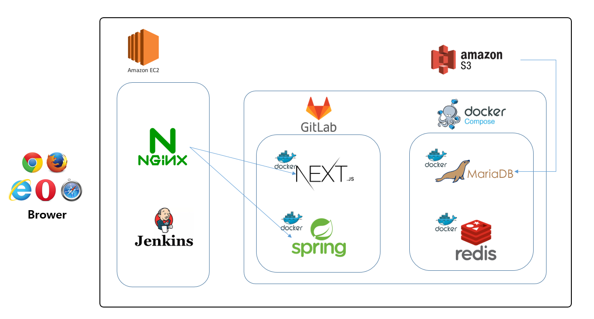

# 게춰크레용(GetYourCrayon) - 함께 즐기는 캐주얼 그림 게임

### :crayon: [즐겁게 게임하러 가기](https://getyourcrayon.co.kr/)

### :movie_camera: [게춰크레용](https://youtu.be/GAqydwYB8Cg)

## 📢프로젝트 소개

--- 

### **GetYourCRAYON**

### 

## :scroll: 프로젝트 개요

---

🎲**게임은 재미있는 것!**

실력에 좌절하게 만들고, 팀원을 비난하게 만드는 경쟁 게임에 지치셨나요?

우리는 게임이 스트레스와 갈등이 아니라 기쁨과 휴식을 제공해야 한다고 생각합니다.

모두가 즐길 수 있고, 웃으며 할 수 있는 게임을 만들었습니다.

게춰크레용에서 여러분의 친구와 웃으며 게임하고 리프레쉬 하세요

## :video_game:주요 기능

---

### 1. 친구들과 혹은 모르는 사람들과 가볍게 즐길 수 있는 캐주얼 게임

- 이기기 위해 경쟁하며 스트레스를 주는 게임이 아닌 친구들과 웃으며 즐길 수 있는 게임을 제공합니다

### 2. 게임을 하며 얻은 포인트로 획득할 수 있는 수집요소

- 게임을 즐기며 얻은 포인트로 수집요소를 뽑을 수 있습니다. 숨겨져있는 수집요소도 있으니 한번 도전해보세요

## 🎬프로젝트 기간

---

- 2023.04.10~ 2023.05.19

## :hammer_and_wrench:  프로젝트 사용 기술

---

**Back-end : Spring Boot**

```Plane
- Springboot 2.7.8
- Spring Data JPA
- Spring Security
- Redis
- OAuth2
- MariaDB
- Logger
```

**Front-end : Next.js**

```Plane
- next : 13.3.1
- next-redux-wrapper : 8.1.0
- react : 18.2.0
- reduxjs/toolkit : 1.9.5
- react-dom : 18.2.0
- tailwindcss : 3.3.2
- websocket : 1.0.34
- typescript : 5.0.4
```

**CI/CD**

```Plane
- Git Webhook
- Jenkins
- Docker
- Docker Compoose
- Docker Hub
- Nginx
- Letsencrypt
```

**Tool**

```Plane
- Visual Studio Code
- IntelliJ IDEA
- Figma
- MySQL Workbench
```

## :rocket:협업 방식

---

### **Matter Most**

- 평상시 소통을 위한 도구
- 짧은 코드나 레퍼런스 url 공유

### **Notion**

- Config 정리
- 회의록 저장
- 피드백 공유

### **Figma**

- 기획 회의
- 와이어 프레임 구성
- 직접 화면을 구성하면서 회의

### **Jira**

- 일정 관리

### **Git-lab**

- 개발 코드 형상 관리
- 메인, 작업 브랜치와 개인 브랜치 구분

---

## :clipboard: 주요 산출물

[Notion Link](https://curved-building-00e.notion.site/665cbf973121449386b582f0f4b0d00e)

---

### **와이어 프레임 및 화면 설계**

[Figma Link](https://www.figma.com/file/4LzYD3L6NChuTpZ41B8lOW/FINAL?type=design&node-id=0-1)


### **기능 명세서**

[기능명세서 Link](https://curved-building-00e.notion.site/435f73c36b8b418cb181a0cc3c195b74)


### **요구사항 명세서**

[요구사항 명세서 Link](https://curved-building-00e.notion.site/9840daf037344113b54627f874fc0e3a)


### **API 명세서**

[API명세서 Link](https://curved-building-00e.notion.site/API-4c3845accf4548698bcc201f90923a73)



### **ERD**

[ERD Link](https://www.erdcloud.com/d/7FgkNmKggnrqCM2FX)



### **아키텍처**



## :framed_picture:서비스 화면

---

### **메인 페이지**

- 게임틱한 디자인으로 프로젝트 정체성을 살렸습니다.

- 처음 이용하는 유저를 위해 사이트를 소개하는 슬라이더를 준비했습니다.

- 게임하기 버튼을 클릭하여 게임을 생성할 수 있습니다.

- 같이하기 버튼을 통해서 게임방의 링크를 확인하고 참여할 수 있습니다


### **게임 페이지**

- 서비스에 존재하는 게임들을 플레이할 수 있습니다.

- 대기방 페이지에서 게임 종류, 최대인원, 그리기 시간 등을 설정할 수 있습니다.


### **마이페이지**

- 게임을 통해 획득한 포인트로 뽑기를 진행할 수 있습니다
- 각 뽑기에는 등급이 존재합니다
- 포인트로 뽑은 수집요소를 마이페이지 이미지로 변경할 수 있습니다.


