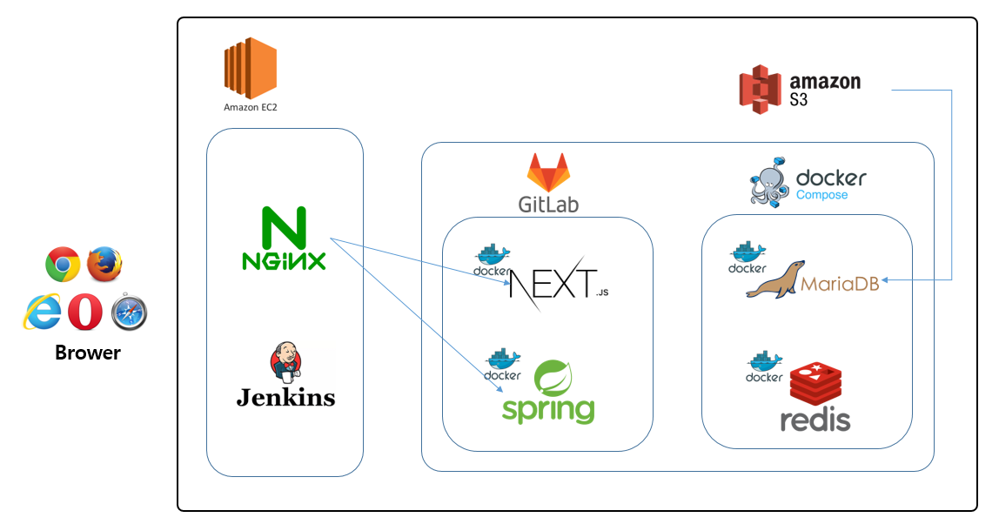

# 배포 포팅 메뉴얼

# 아키텍처

---



- 웹 프로젝트 진행

## EC2 Local

- Nignx, Jenkins
- 설정에 잦은 변경이 필요하지 않으므로 EC2 내부에서 구동하도록 설정

# 배포 환경

---

- Linux (ubuntu 20.04.1)
- JDK (openjdk 11.0.18)
- Jenkins (2.387.2)
- Nginx (version: nginx/1.18.0)
- Docker (version 23.0.4)
- Docker Comose (version v2.17.2)
- MariaDB(Docker image 10.11.2)
- redis (redis:7)
- EC2
- S3

# 사전 매뉴얼

---

> 도메인은 `$DOMAIN`으로 대체되어있습니다. 서버의 도메인에 따라 변경하세요
> 
> 
> 도커의 포트는 `$PORT`로 대체되어있습니다. ***해당 포트로 변경하세요***
> 
> BUILDNUMBER가 없는 오류가 발생 할 때 ***docker-compose.yml의 image부분에서 :$BUILD_NUMBER를 지워주세요***
> 
> 준비가 필요한 파일은 ***개인정보*** 혹은 ***큰 용량*** 때문에 제거되었습니다
> 
> 키의 비밀번호가 필요한 ***app-build는 제거*** 되었습니다
> 
> 젠킨스로 빌드하려면 ***각각의 Jenkinsfile*** 을 연결하면 됩니다
> 
> 아래 내용은 ***젠킨스 없이*** 빌드하는 과정입니다.
> 

## 서버 설정

1. Docker와 Docker-compose가 설치되어있어야합니다.
2. docker-compose.yml 파일과 config 설정 파일을 위치합니다.
3. 모델을 위치합니다.

# 빌드

---

## 0. Nginx

> /etc/letsencrypt/archive/$DOMAIN/ 위치에 SSL 인증키 준비
> 
> 
> cd /etc/nginx/sites-available/default 위치에 proxy 설정 파일 준비
> 

```
server {
        listen 80 default_server;
        server_name $DOMAIN;

        access_log /var/log/nginx/web.access.log;
        error_log /var/log/nginx/web.error.log;

        return 308 https://$server_name$request_uri;    # HTTPS로 리다이렉팅

}

server {
        listen 443 ssl default_server; 
        ssl on;
        server_name $DOMAIN(서버 도메인);

        ssl_certificate /etc/letsencrypt/live/$DOMAIN(서버 도메인)/fullchain.pem;
        ssl_certificate_key /etc/letsencrypt/live/$DOMAIN(서버 도메인)/privkey.pem;

        # for container
        location /getchacrayon/image/history {
                root /;
				}

        location / {

                proxy_pass http://localhost:$PORT(프론트 서버 포트);
                proxy_set_header Host $host;
                proxy_set_header X-Real-IP $remote_addr;
                proxy_set_header X-Forwarded-For $proxy_add_x_forwarded_for;
        }

        location /api {
                proxy_set_header Upgrade $http_upgrade;
                proxy_set_header Connection "upgrade";
                proxy_http_version 1.1;

                proxy_pass_request_headers on;
                proxy_set_header X-Real-IP $remote_addr;
                proxy_set_header X-Forwarder-For $proxy_add_x_forwarded_for;
                proxy_set_header Host $http_host;

                # add_header 'Access-Control-Allow-Origin' '*' always;
                add_header 'Access-Control-Allow-Methods' '*';

                proxy_pass http://localhost:$PORT(백엔드 서버 포트);
        }
}
```

## 1. 프론트

- 서비스명 : crayon-next-container
- 젠킨스 파일명 : Jenkinsfile

## 2. 백

- 서비스명 : crayon-spring-container
- 젠킨스 파일명 : Jenkinsfile

### build.gradle

```java
buildscript {
	ext {
		queryDslVersion = "5.0.0"
	}
}

plugins {
	id 'java'
	id 'org.springframework.boot' version '2.7.10'
	id 'io.spring.dependency-management' version '1.0.15.RELEASE'
	// querydsl 추가
	id "com.ewerk.gradle.plugins.querydsl" version "1.0.10"
}

group = 'com.seventnight'
version = '0.0.1-SNAPSHOT'
sourceCompatibility = '11'

configurations {
	compileOnly {
		extendsFrom annotationProcessor
	}
}

repositories {
	mavenCentral()
}

dependencies {
	// starter-web
	implementation 'org.springframework.boot:spring-boot-starter-web'

	// JPA
	implementation 'org.springframework.boot:spring-boot-starter-data-jpa'

	// Redis
	implementation 'org.springframework.boot:spring-boot-starter-data-redis'

	// MariaDB
	runtimeOnly 'org.mariadb.jdbc:mariadb-java-client'

	// SQL 파라미터 확인
	implementation 'com.github.gavlyukovskiy:p6spy-spring-boot-starter:1.6.1'

	// Lombok
	compileOnly 'org.projectlombok:lombok'
	annotationProcessor 'org.projectlombok:lombok'

	// dev-tools 및 기타등등
	developmentOnly 'org.springframework.boot:spring-boot-devtools'
	testImplementation 'org.springframework.boot:spring-boot-starter-test'

	// querydsl 추가
	implementation "com.querydsl:querydsl-jpa:${queryDslVersion}"
	annotationProcessor "com.querydsl:querydsl-apt:${queryDslVersion}"

	// JWT Dependency
	implementation group: 'io.jsonwebtoken', name: 'jjwt', version: '0.9.1'

	// Configuring the Annotation Processor
	annotationProcessor "org.springframework.boot:spring-boot-configuration-processor"
	
	// OAuth2
	implementation 'org.springframework.boot:spring-boot-starter-oauth2-client'
	
	// Security
	implementation 'org.springframework.boot:spring-boot-starter-security'
	testImplementation 'org.springframework.security:spring-security-test'
	
	// S3
	implementation "com.amazonaws:aws-java-sdk-s3:1.12.281"
	
	// WebSocket
	implementation 'org.springframework.boot:spring-boot-starter-websocket'
	
	// WebClient (AI 사진 요청)
	implementation group: 'org.springframework.boot', name: 'spring-boot-starter-webflux'

	// Apache Commons IO (사진 저장)
	implementation 'commons-io:commons-io:2.11.0'

}

tasks.named('test') {
	useJUnitPlatform()
}

// querydsl 세팅 시작
def querydslDir = "$buildDir/generated/querydsl"
querydsl {
	jpa = true
	querydslSourcesDir = querydslDir
}
sourceSets {
	main.java.srcDir querydslDir
}
configurations {
	querydsl.extendsFrom compileClasspath
}
compileQuerydsl {
	options.annotationProcessorPath = configurations.querydsl
}
// querydsl 세팅 끝
```

### applicadtion-server

```java
spring:
  datasource:
    url: jdbc:mariadb://${IP}(서버):${PORT}(spring 포트)/crayon
    driver-class-name: org.mariadb.jdbc.Driver
    username: ${USER}
    password: ${PASSWORD}
    hikari:
      pool-name: jpa-hikari-pool
      maximum-pool-size: 5
      jdbc-url: ${spring.datasource.url}
      username: ${spring.datasource.username}
      password: ${spring.datasource.password}
      driver-class-name: ${spring.datasource.driver-class-name}
      data-source-properties:
        rewriteBatchedStatements: true
  jpa:
    database: mysql
    database-platform: org.hibernate.dialect.MySQL5InnoDBDialect
    properties:
      hibernate:
        jdbc.batch_size: 1000
        format_sql: true
        show_sql: true
        use_sql_comments: true
    defer-datasource-initialization: true
  redis:
    lettuce:
      pool:
        max-active: 10
        max-idle: 10
        min-idle: 2
    port: ${PORT}(redis 포트)
    host: ${IP}(서버)
    password: ${PASSWORD}

  # Security OAuth
  security:
    oauth2.client:
      registration:
        naver:
          # 애플리케이션 정보 - Client ID
          clientId: ${clientId}
          # 애플리케이션 정보 - Client Secret
          clientSecret: ${clientSecret}
          clientAuthenticationMethod: post
          authorizationGrantType: authorization_code
          redirectUri: "{baseUrl}/{action}/oauth2/code/{registrationId}"
          scope:
            - email
          clientName: Naver
        kakao:
          # REST API 키
          clientId: ${clientId}
          # 보안 -> secret key
          clientSecret: ${clientSecret}
          clientAuthenticationMethod: POST
          authorizationGrantType: authorization_code
          redirectUri: http://localhost:8080/login/oauth2/code/kakao
          scope:
            - account_email
            - profile_nickname
          clientName: Kakao
      # Provider 설정
      provider:
        naver:
          authorizationUri: https://nid.naver.com/oauth2.0/authorize
          tokenUri: https://nid.naver.com/oauth2.0/token
          userInfoUri: https://openapi.naver.com/v1/nid/me
          userNameAttribute: response
        kakao:
          authorizationUri: https://kauth.kakao.com/oauth/authorize
          tokenUri: https://kauth.kakao.com/oauth/token
          userInfoUri: https://kapi.kakao.com/v2/user/me
          userNameAttribute: id
  mvc:
    pathmatch:
      matching-strategy: ant_path_matcher

# cors 설정
cors:
  allowed-origins: 'http://localhost:3000'
  allowed-methods: GET,POST,PUT,DELETE,OPTIONS
  allowed-headers: '*'
  max-age: 3600

logging:
  level:
    root: info
    org:
      hibernate: info

redirect:
  url: http://${IP}(서버):3000/
```

# 세부 정리

---

## nginx


### sudo vi /etc/nginx/sites-available/default

```java
server {
        listen 80 default_server;
        server_name getyourcrayon.co.kr;

        access_log /var/log/nginx/web.access.log;
        error_log /var/log/nginx/web.error.log;

        return 301 https://$server_name$request_uri;    # HTTPS로 리다이렉팅

}

server {
        listen 443 ssl default_server; 
        ssl on;
        server_name getyourcrayon.co.kr;

        ssl_certificate /etc/letsencrypt/live/getyourcrayon.co.kr/fullchain.pem;
        ssl_certificate_key /etc/letsencrypt/live/getyourcrayon.co.kr/privkey.pem;

        # for container
        location / {
                proxy_pass http://localhost:${PORT}(프론트 포트번호);
                proxy_set_header Host $host;
                proxy_set_header X-Real-IP $remote_addr;
                proxy_set_header X-Forwarded-For $proxy_add_x_forwarded_for;
        }

        location /api {
                proxy_set_header Upgrade $http_upgrade;
                proxy_set_header Connection "upgrade";
                proxy_http_version 1.1;

                proxy_pass_request_headers on;
                proxy_set_header X-Real-IP $remote_addr;
                proxy_set_header X-Forwarder-For $proxy_add_x_forwarded_for;
                proxy_set_header Host $http_host;

                add_header 'Access-Control-Allow-Methods' '*';

                proxy_pass http://localhost:8080;
        }
}
```

- 도메인 : **getyourcrayon.co.kr**
- http로 접속 시도 했을 때 https로 리다이렉팅 진행
- https 보안설정을 위해 보안 키 설정 ← letsencyript에서 보안 키 발급
- 일반경로( / )로 접속 → 리버스 프록시를 통해 localhost:3002로 전달
- API경로( /api )로 접속 → localhost:8080으로 전달
- Nginx가 EC2 내부에 설치되어 사용되고 있으므로, 프론트와 백 접속은 localhost의 포트 번호로 접속할 수 있음

## Jenkins

### front-end의 jenkins파일

- front/ 디렉토리에 Jenkinsfile을 생성하고 아래 코드를 입력한다.

```yaml
# front/Jenkinsfile
pipeline {
    agent any
    stages {
        stage('CLONE') {
            steps {
                git branch: 'build_fe2', credentialsId: 'credential_Id', url: 'https://${URL}(프로젝트 경로)'
            }
        }

        stage('DOCKER BUILD') {
            steps
            {
                withCredentials([file(credentialsId: 'frontEnv', variable: 'env')]) {
                    script {
                        sh 'chmod 755 front/.env'
                        sh 'cp $env front/.env'
                        sh '''
                        cd  front/
                        cat .env
                        ls -al
                        '''
                    }
                }

                sh '''
                echo 'docker build dir ' ${PWD}
                cd front
            
                docker stop crayon-next-container || true
                docker rm crayon-next-container || true
                
                
                docker rmi gmkim716/crayon-next-container || true
                echo 'Remove if gmkim716/crayon-next-container exist'
                
                docker build -t gmkim716/crayon-next-container .
                '''
            }
        }

        stage('DEPLOY') {
            steps {
            sh '''
            echo 'delete previous crayon-next-container'
            # docker stop crayon-next-container
            # docker rm crayon-next-container
            docker run -d -p ${PORT}(프론트 포트):3000 -v /getchacrayon/image/:/getchacrayon/image/ --name crayon-next-container gmkim716/crayon-next-container
            echo 'Success: next'
            '''
            }
        }
    }
}
```

### back-end의 jenkins 파일

- back-end/coldcrayon/ 디렉토리에 jenkinsfile을 생성하고 아래 코드를 입력한다.

```yaml
# back-end/coldcrayon/Jenkinsfile
pipeline {
    agent any
    stages {
        stage('CLONE') {
            steps {
                git branch: 'build_be', credentialsId: 'credential_Id', url: 'https://${URL}(프로젝트 경로)'
            }
        }

        stage('BUILD') {
            steps {
                withCredentials([file(credentialsId: 'server', variable: 'yml')]) {
                    script {
                        sh 'cp $yml back-end/coldcrayon/src/main/resources/application-server.yml'
                        sh '''
                        cd back-end/coldcrayon/src/main/resources
                        cat application-server.yml
                        ls -al
                        '''
                    }
		        }
                sh '''
                cd back-end/coldcrayon
                chmod +x gradlew
                ./gradlew clean build
                '''
            }
        }
        stage('DOCKER BUILD') {
            steps
            {
                sh '''
                cd ./back-end/coldcrayon
                pwd
                docker build -t gmkim716/crayon-spring-container .
                '''
            }
        }

        stage('DEPLOY') {
            steps {
            sh '''
            echo 'delete previous spring-container'
            docker stop crayon-spring-container
            docker rm crayon-spring-container
            docker run -d -p ${PORT}(백엔드 포트):8080 -v /getchacrayon/image/history/:/getchacrayon/image/history/ --name crayon-spring-container gmkim716/crayon-spring-container
            echo 'Success'
            '''
            }
        }
    }
}
```

## 2. jenkins 설정


- 젠킨스 설정에 필요한 정보를 credentials에 담아서 보관
    - crayon_token : Webhook 설정을 위해 Gitlab에서 받아온 토큰 정보
    - credential_id : Gitlab 프로젝트 접근 권한을 확인하기 위한 유저 정보
    - clientId
    - clientIdSecret
    - server : application-server.yml : 서버용 환경 변수가 담김
    - frontEnv : 프론트 환경변수 설정 파일
    - envProperties : 백 환경변수 설정 파일

## Docker-Compose


[docker-compose.yml](%E1%84%87%E1%85%A2%E1%84%91%E1%85%A9%20%E1%84%91%E1%85%A9%E1%84%90%E1%85%B5%E1%86%BC%20%E1%84%86%E1%85%A6%E1%84%82%E1%85%B2%E1%84%8B%E1%85%A5%E1%86%AF%20e3501b79b1e749ab832deefaf081b68b/docker-compose.yml)

1. 위에 있는 docker-compose.yml을 다운로드 한다.
2. cmd 또는 bash로 docker-compose가 있는 디렉토리까까지 이동한다.
3. shell에 `docker compose -f docker-compose.yml up -d` 명령어를 입력하여, 컨테이너를 실행한다. 

## Docker

### Front-Docker file

- front/ 디렉토리 안에 Dockerfile을 생성한다.
- Dockerfile 안에 아래의 코드를 입력한다.

```yaml
# Dockerfile

# 사용할 베이스 이미지
FROM node:18-alpine

# 작업 디렉토리 생성
WORKDIR /app

# 앱의 의존성 설치
COPY package*.json ./
RUN npm install

# 소스 코드 복사
COPY . .

# 앱 빌드
RUN npm run build

# 환경 변수 설정
ENV NODE_ENV production
ENV PORT 3000

# 컨테이너 포트 오픈
EXPOSE 3000

# 앱 실행
CMD ["npm", "start"]
```

### Back-Docker file

- back/ 디렉토리 안에 Dockerfile을 생성한다.
- Dockerfile 안에 아래의 코드를 입력한다.

```yaml
FROM openjdk:11-jre
LABEL "Author"="gmkim"
LABEL "Project"="spring-boot"
COPY build/libs/coldcrayon-0.0.1-SNAPSHOT.jar app.jar
ENTRYPOINT ["java", "-jar", "app.jar"]
```

# 소셜로그인

---

소셜로그인 관련 준비사항

1. 카카오 디벨로퍼 접속
2. 내 애플리케이션 -> 애플리케이션 추가
3. 동의항목 : 닉네임, 카카오계정
4. 앱키 (REST API키) 복사 후 보관
5. 플랫폼 -> Web -> 웹 사이트 주소 등록(로컬의 경우 [http://localhost:8080](http://localhost:8080/))
6. 보안 -> 클라이언트 시크릿 코드 복사 후 보관
7. yml에 해당 코드 작성

```yaml
kakao:
    # REST API 키
    clientId: {앱키}
    # 보안 -> secret key
    clientSecret: 클라이언트 시크릿 코드
    clientAuthenticationMethod: POST
    authorizationGrantType: authorization_code
    redirectUri: http://localhost:8080/login/oauth2/code/kakao
    scope:
      - account_email
      - profile_nickname
    clientName: Kakao
    # Provider 설정
    provider:
      naver:
        authorizationUri: https://nid.naver.com/oauth2.0/authorize
        tokenUri: https://nid.naver.com/oauth2.0/token
        userInfoUri: https://openapi.naver.com/v1/nid/me
        userNameAttribute: response
      kakao:
        authorizationUri: https://kauth.kakao.com/oauth/authorize
        tokenUri: https://kauth.kakao.com/oauth/token
        userInfoUri: https://kapi.kakao.com/v2/user/me
        userNameAttribute: id
```